# Personalized-Stock-Recommendation-System


This project implements a **hybrid stock recommendation engine** that combines **collaborative filtering, content-based filtering, and learning-to-rank**.  
It is designed to mimic real-world personalization systems, to help users discover the most relevant financial assets.  

### 🔹 Workflow Diagram  

```mermaid
flowchart TD
    A[📂 Data Loader] --> B[📊 EDA & Insights]
    B --> C1[🤝 Collaborative Filtering]
    B --> C2[📑 Content-Based Filtering]
    C1 --> D[⚡ Hybrid Recommender]
    C2 --> D[⚡ Hybrid Recommender]
    D --> E[📈 Ranker: Diversification & Risk Metrics]
    E --> F[✅ Final Recommendations]
```


---
<p>
The recommendation engine in this project is built using a combination of techniques. The collaborative filtering module (src/collaborative_filtering.py) analyzes patterns across multiple users’ portfolios. If two users hold similar stocks, the system recommends to one user the stocks that the other holds but they do not, effectively learning from the collective behavior of investors. Complementing this, the content-based filtering module (src/content_based.py) focuses on stock attributes such as sector, risk level, and volatility. It recommends new stocks that share characteristics with those already in the user’s portfolio, allowing for suggestions that align with a user’s existing preferences. To balance the strengths of both methods, the hybrid recommender (src/hybrid_recommender.py) combines collaborative and content-based approaches, producing recommendations that consider both “what people like me bought” and “what looks like what I already like.”

Once recommendations are generated, they are refined by the ranking system (src/ranker.py), which scores suggestions using multiple factors. This includes portfolio diversification (avoiding too much concentration in a single sector), risk-adjusted return metrics such as Sharpe ratio and volatility, and broader popularity or market trends. The result is a sorted list of recommendations optimized for balance and relevance. Finally, the evaluation module (src/evaluation.py) validates the system’s performance by measuring precision, recall, coverage, and diversity. These metrics are used to fine-tune the weights of the hybrid model and ensure that the recommendations are both accurate and useful.
</p>

---

## 🚀 Features
- **Collaborative Filtering** (LightFM) for user–stock interactions  
- **Content-Based Filtering** (TF-IDF + cosine similarity on stock metadata)  
- **Hybrid Recommender** that blends multiple approaches  
- **Learning-to-Rank** with XGBoost for personalized ranking  
- **Evaluation Module** with precision@k, recall@k, and A/B test simulation  

---

## 📂 Project Structure

```bash
personalized-stock-recommender/
│── data/
│   └── sample_portfolios.csv
│
│── notebooks/
│   └── EDA.ipynb
│
│── src/
│   ├── data_loader.py
│   ├── collaborative_filtering.py
│   ├── content_based.py
│   ├── hybrid_recommender.py
│   ├── ranker.py
│   ├── evaluation.py
│
│── main.py
│── requirements.txt
│── README.md
```
---

## ⚙️ Installation
```bash
git clone https://github.com/yourusername/personalized-stock-recommender.git
cd personalized-stock-recommender
pip install -r requirements.txt
```
